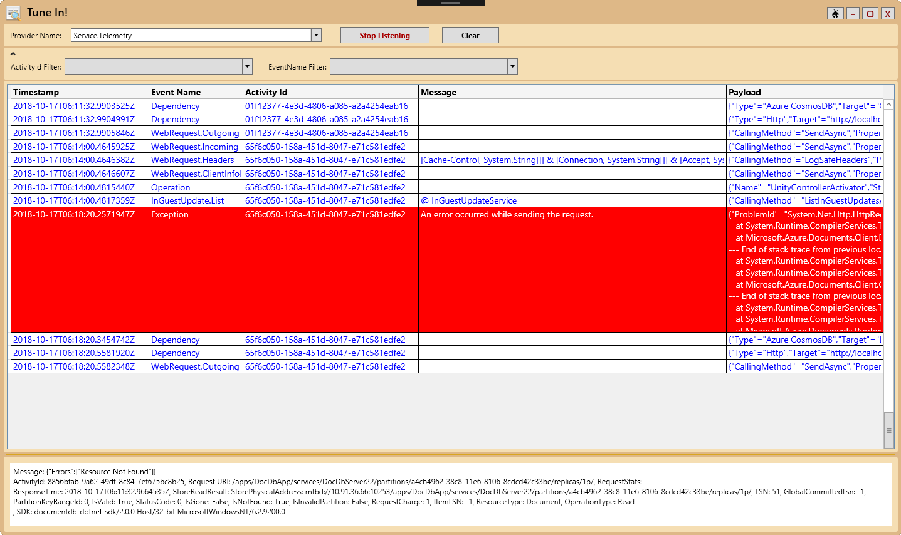

# TuneIn

TuneIn tool I created for telemetry debugging/validation. It listens to events from the selected provider, display events as they arrive at real-time, and allow filtering on activity id and/or event name. To use: select your provider, then click start listening.

